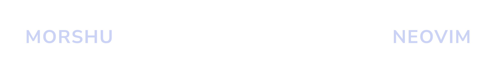
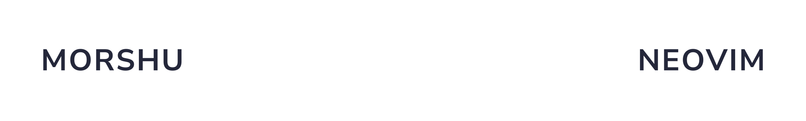

  
  

A development environment setup for [Neovim](https://neovim.io).

# Requirements

- A desktop platform with the [Lua 5.4](https://www.lua.org/manual/5.4/) or higher runtime installed.
- The latest version of [Neovim](https://neovim.io) installed.
- When working with the codebase, we recommend using an IDE with intellisense and syntax highlighting, such as [Neovim](https://neovim.io) or [Visual Studio Code](https://code.visualstudio.com).

# License

This library is licensed under the [GPL-3.0 License](https://opensource.org/licenses/gpl-3-0). Please see [the license file](../LICENSE) for more information. [tl;dr](https://www.tldrlegal.com/license/gnu-general-public-license-v3-gpl-3) you can do whatever you want as long as you include the original copyright and license notice in any copy of the software/source.
